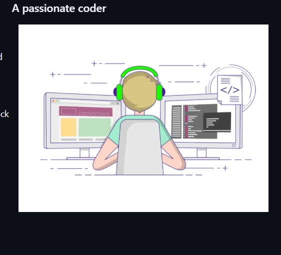

<h1 align="center">Hi 👋, I'm Vaishnavi Phatak</h1>
<h3 align="center">A passionate coder</h3>

  

---

<table>
<tr>
<td width="55%" valign="top">

- 🎓 **BTech in Computer Science and Engineering**  
- 💡 **Competitive Programming Enthusiast**  
- 🌍 **Currently diving into Data Science and building exciting projects**  
- 📫 **How to reach me:**  
  <a href="mailto:vaishnaviphatak8@gmail.com">vaishnaviphatak8@gmail.com</a>

  

### Connect with me:

  
  &nbsp;&nbsp;
  
  &nbsp;&nbsp;
  
  &nbsp;&nbsp;
  

 

### Languages and Tools:

  
  
  
  
  
  
  

</td>

<td width="45%" align="center">
  
</td>

</tr>
</table>

